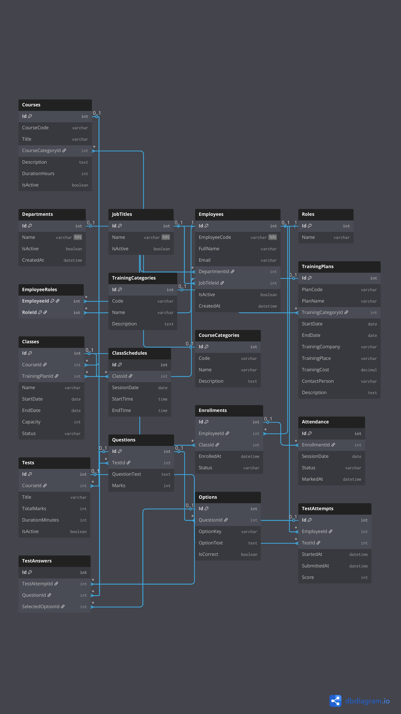

# Training Management System (TMS) – Backend API

A production-ready **ASP.NET Core Web API** built using **Clean Architecture** principles for managing employees, departments, and training workflows.

---

## 🚀 Tech Stack

- **.NET 8**
- **ASP.NET Core Web API**
- **Entity Framework Core**
- **SQL Server**
- **FluentValidation**
- **Serilog**
- **Swagger (OpenAPI)**

---

## 🏗 Architecture

```
This project follows **Clean Architecture**:
TMS.API
│
├── Controllers
├── Middlewares
│
TMS.Application
│
├── Services
├── DTOs
├── Interfaces
├── Validators
│
TMS.Domain
│
├── Entities
├── BaseEntity
│
TMS.Infrastructure
│
├── Persistence
│ ├── DbContext
│ ├── Configurations
│ ├── Migrations
```
### Layer Responsibilities

- **API Layer**
  - Controllers
  - Middleware (Global Exception Handling)
  - Swagger

- **Application Layer**
  - Business logic
  - Services
  - DTOs
  - FluentValidation

- **Domain Layer**
  - Core entities
  - BaseEntity (Soft delete, audit fields)

- **Infrastructure Layer**
  - EF Core DbContext
  - Entity configurations
  - Database migrations

---

## ✅ Features Implemented (Phase 1)

### 👤 Employee Management
- Create / Read / Update / Soft Delete employee
- FluentValidation for request validation
- Business rules enforcement
- Structured logging with Serilog

### 🏢 Department Management
- Full CRUD with soft delete
- Prevent delete if active employees exist
- Validation and logging

### 🔧 Cross-cutting Concerns
- Global exception handling middleware
- Dependency Injection
- Soft delete using `isActive`
- Swagger API documentation

---
## Database


## 🧪 API Documentation

Swagger UI is enabled for easy testing: https://localhost:{port}/swagger

---

## 🛡 Error Handling

All exceptions are handled centrally using a **custom exception middleware**, providing consistent JSON error responses with proper HTTP status codes.

---

## 📊 Logging

Logging is implemented using **Serilog**, configured via `appsettings.json`.

- Information logs for business events
- Centralized structured logging
- Ready for file / database / Seq sinks

---

## 🔐 Security Notes

- Sensitive configuration files (`appsettings.json`) are **excluded from source control**
- `.gitignore` is properly configured
- Example configuration file provided

---

## ⚙️ How to Run the Project

### 1️⃣ Clone the repository
```bash
git clone https://github.com/momin210103/TrainingManagementSystem.API.git
```
## Configure Database
appsetting.json
Example 
```bash
{
  "ConnectionStrings": {
    "DefaultConnection": "Server=YOUR_SERVER;Database=TMS;User Id=USER;Password=PASSWORD;"
  }
}
```
## Apply Migrations `dotnet ef database update`
## Run Appllication `dotnet run`

### 🗺 Roadmap
### 🔜 Phase 2


**Global Query Filter for Soft Delete**

**Pagination & Filtering**

**JWT Authentication & Authorization**

# Phase 3 

**Training Management Flow**

**Assessment Module**

**Unit Testing**

**Performance optimizations**
# Author
MD. Abdul Momin Sheikh
___
### ASP.NET Core Backend Developer
### Focused on clean code & real-world backend systems
### Learning-oriented, production-driven development


